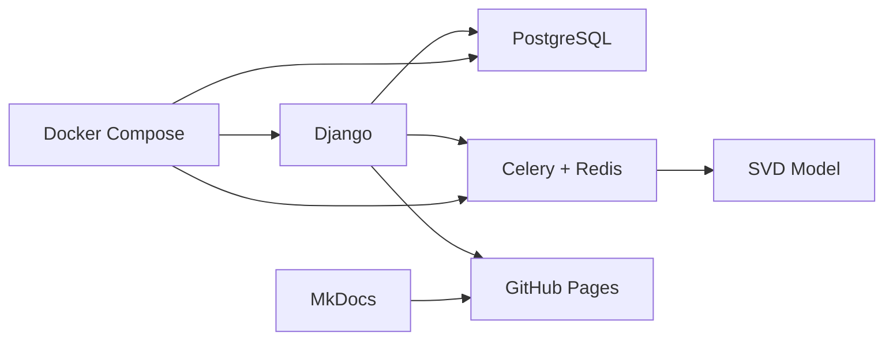

# Báo cáo Hybrid Movie Recommendation System

**VẬN HÀNH HỆ THỐNG HỌC MÁY - IT5414**

---

## Thông tin dự án

| | |
|---|---|
| **Mã học phần** | IT5414 |
| **Mã lớp** | 164864 |
| **Đại học** | Bách Khoa Hà Nội |
| **Trường** | Công Nghệ Thông Tin và Truyền Thông |

### Thành viên tham gia

- **Bùi Anh Đức** - 20241582E
- **Bùi Tá Đức** - 20241583E
- **Nguyễn Hải Phong** - 20241614E

**Ngày hoàn thiện:** 28 tháng 12 năm 2025

---

## Tổng quan báo cáo

Báo cáo này trình bày quá trình phát triển, triển khai và vận hành **Hệ thống gợi ý phim kết hợp (Hybrid Movie Recommendation System)** sử dụng:

- **Django**: Web framework chính
- **Machine Learning**: Collaborative Filtering với SVD
- **MLOps**: Celery + Redis + Docker Compose
- **Database**: PostgreSQL
- **Deployment**: Docker containers

---

## Cấu trúc báo cáo

### Chương I: Giới thiệu
Tổng quan về dự án, lý do lựa chọn, phạm vi và đối tượng

### Chương II: Mục tiêu
Mục tiêu tổng quát và cụ thể của dự án

### Chương III: Tổng quan về ML trong project
Bài toán ML, dữ liệu, mô hình, quy trình huấn luyện

### Chương IV: Triển khai và vận hành mô hình ML
Quy trình training, deployment, môi trường, monitoring

### Chương V: Kết luận
Kết quả đạt được, hạn chế, hướng phát triển

---

## Tài liệu bổ sung

- **Báo cáo chi tiết:** [Xem báo cáo đầy đủ](documentation.md)
- **GitHub Repository:** https://github.com/Taduc2003/MovieRecommeder
- **Live Demo:** https://taduc2003.github.io/MovieRecommeder/

---

## Công nghệ sử dụng

- **Backend:** Django 4.0.7
- **ML Algorithm:** Surprise (scikit-surprise) - SVD Collaborative Filtering
- **Task Queue:** Celery + Redis
- **Database:** PostgreSQL 13
- **Containerization:** Docker & Docker Compose
- **Documentation:** MkDocs + Material Theme
- **CI/CD:** GitHub Actions
- **Hosting:** GitHub Pages

### Chương V: Kết luận
Kết quả đạt được, hạn chế, hướng phát triển tương lai

---

**Để bắt đầu, vui lòng chọn chương bạn muốn đọc từ menu bên trái.**
